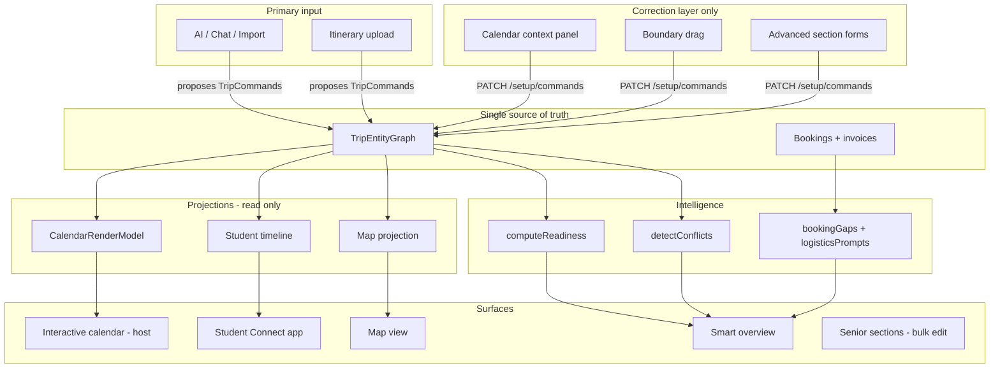
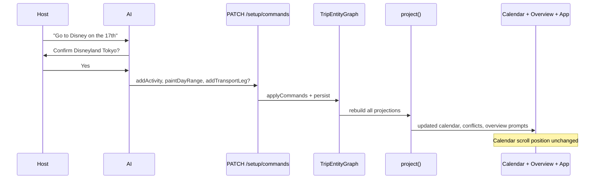

# Trip Connect — Product Vision & Build Brief

> **Purpose:** Hand this file to Cursor, ChatGPT, or any collaborator. It describes what we are actually building — not just the setup board, but the full trip operating system.
>
> **Last updated:** June 2026
>
> **Canonical build memory (phases, rules, golden trip):** [`ITINERARY_LIVE_BUILD_MEMORY.md`](./ITINERARY_LIVE_BUILD_MEMORY.md) — read that first before any phase work.

---

## One sentence

**A single trip truth (graph) that AI can read, write, and correct — which automatically projects into a beautiful interactive calendar, student app, and map — with smart admin oversight (conflicts, invoices, logistics gaps) — where manual UI exists only to fix what AI got wrong, not to build trips from scratch.**

---

## The real product (not just a setup board)

We are not building “a form-heavy trip planner.” We are building **a trip operating system for school groups** with three faces on the same data:

| Surface | Audience | What it shows |
|---------|----------|----------------|
| **Interactive calendar** | Host / school admin | To-scale visual trip: locations, stays, transport corridors, activities, boundaries — the “cool calendar that matches our trip” |
| **Student Connect app** | Students & families | Day-by-day itinerary, what to bring, where to be, transport notes |
| **Map view** | Everyone | Places, routes, distances, “hotel → Disney” style logistics |

All three are **projections of one model**. Change the graph once → calendar, app, map, overview, and senior sections all update. No re-typing. No drift.

---

## What “senior sections” means (critical)

**Accommodation, transportation, and location are not activities.** They are first-class trip layers:

- **Location** — where the group is (painted on days / city spans)
- **Accommodation** — named stays with check-in/out, linked to nights
- **Transport** — flights, trains, intercity legs, airport transfers
- **Activities** — things you *do* on top of that skeleton (Disney, temple visit, school meeting)

The calendar visualizes all layers together. The admin sections hold the structured records. Activities sit on top — they do not replace stays or flights.

---

## How trips get into the system (primary path)

**Manual entry is the exception, not the workflow.**

### Primary ingestion

1. School uploads an itinerary (PDF, Word, spreadsheet, email paste)
2. Or chats: *“Hey we plan to go to Disney on the 17th”*
3. AI parses intent → proposes structured commands
4. System confirms ambiguities: *“Just confirming you mean Disneyland Tokyo?”* → Yes
5. AI dispatches graph commands: activity + location + optional transport suggestions
6. Projections refresh everywhere automatically

### Example conversation flow

```
Host:  "We plan to go to Disney on the 17th"

AI:    "Just confirming you mean Disneyland Tokyo?"
       [ Yes ]  [ No, I meant… ]

Host:  [ Yes ]

AI:    "I'll add Disneyland Tokyo on the 17th with address.
        Your hotel is in Shinjuku — want transport options from hotel to Disney?"
       [ Add suggested train route ]  [ Add taxi estimate ]  [ Skip for now ]

Host:  [ Add suggested train route ]

→ Graph updates → calendar shows activity + transport corridor
→ Student app shows the day
→ Map pins Disney + route from hotel
```

**The manual calendar + context panel is the correction layer** — drag a boundary, fix a wrong city, delete a duplicate stay, adjust a flight date. It must exist so AI has something reliable to patch. It is **not** the main way schools build trips.

---

## The interactive calendar (non-negotiable UX)

This is the hero surface for hosts.

### Interaction

- Click to select days / ranges
- Contextual panel: “what do you want to add or fix?” (paint location, stay, transport, activity)
- Draggable stay boundaries where appropriate
- Transport corridor clicks open the right leg context
- Everything saves via **commands** to the trip graph (not client-side fantasy state)

### Visual

- **To-scale calendar** that looks like the actual trip — location bands, hotel spans, transport corridors, activity markers
- Easy to read at a glance: where are we, when do we move, what’s booked
- Subgroup overlays where needed

### Scroll behavior (hard rule)

> **The calendar must NEVER snap or jump when you click things.**

| Allowed | Not allowed |
|---------|-------------|
| User scrolls with mouse/trackpad/touch | Scroll on day click |
| User explicitly clicks “go to date” (if we add one) | Scroll on range selection |
| | Scroll on save / command dispatch |
| | Scroll on context panel open |
| | `scrollIntoView` tied to selection state |
| | `scrollAnchorDate` changing when selection changes |

**The only time the calendar viewport moves is when the user scrolls it themselves.**

Selecting a day, opening context, saving, adding a stay — **zero scroll hijacking**.

---

## Auto-population & consistency

When anything is added, changed, or removed, the system should **infer and propagate** — not leave orphan days or silent gaps.

| You add/change | System should automatically |
|----------------|----------------------------|
| Flight arriving Osaka | Paint arrival city on that day; suggest/prompt stay alignment |
| Named stay | Infer location on nights; show hotel band on calendar |
| Stay dates move (boundary drag) | Repaint days, sync intercity legs, surface conflicts |
| Remove stay | Clear inferred location where appropriate; flag gaps |
| Activity with location | Show marker on calendar; appear in student day view |
| Transport leg | Show corridor; check city matches painted location |
| Remove transport | Update corridors; flag unpainted travel days |

**One graph change → all projections recompute.** Calendar, overview warnings, readiness, conflicts, student timeline, map pins.

---

## School admin intelligence (overview & bookings)

The overview is not a static checklist. It should **think**:

- “Everything is booked, but you don’t have an invoice for the Kyoto hotel.”
- “You land in Osaka at 3pm but your accommodation is 2 hours away — want to add airport transfer?”
- “Stay overlaps with return flight.”
- “Activity on a day with no painted location.”
- “Transport arrives in Tokyo; next stay is in Kyoto with no intercity leg.”
- “Disney on the 17th but no transport from hotel — add something?”

### Bookings & receipts layer

- Link bookings to stays, transport, activities
- Track: booked vs not booked vs invoice received vs paid
- Receipts and invoices attached per booking
- Overview surfaces **money/paperwork gaps**, not just itinerary gaps

---

## Conflict detection

Proactive, visible, actionable:

- Stay overlaps
- Transport vs city mismatch
- Impossible timing (arrive after activity starts)
- Accommodation far from arrival airport / activity cluster
- Missing transport between distant locations
- Booking status vs itinerary mismatch

Conflicts show on:

- Overview (trip-level)
- Context panel (range-level)
- Calendar cells (day-level, optional)

---

## Architecture to build toward



### Data flow (commands only)



### Core rules

1. **All writes** = typed `TripCommand[]` → persist → reproject
2. **No monolithic client `setState`** for trip data on the new path
3. **Calendar interaction** = selection + dispatch only (client UI state)
4. **Scroll position** = client-only, never tied to selection or save
5. **AI never writes directly to DB** — only through the same command API as the UI
6. **Senior sections** (location, accommodation, transport) are graph entities, not derived-only
7. **Activities** are a layer on top, not a substitute for location/stay/transport

---

## Trip graph entity layers

```
Trip
├── Basics (name, dates, departure/return cities, timezone)
├── Groups (main + subgroups)
├── Locations (dayPlaces by group — painted cities per day)
├── Accommodation (named stays, check-in/out, booking status)
├── Transport
│   ├── Outbound legs
│   ├── Return legs
│   └── Intercity legs
├── Activities (itinerary items — things you do)
├── Bookings (linked to stays/legs/activities)
│   ├── Invoice received?
│   ├── Receipt attached?
│   └── Payment status
└── Overlay ops (subgroup deltas)
```

---

## What exists today vs what we want

| You want | Today (roughly) |
|----------|------------------|
| AI-first ingestion | **Not built** — manual/command path exists |
| Multi-projection (calendar + app + map) | **Partial** — engine + calendar projection; app/map not wired to same graph |
| Auto-inference on every change | **Partial** — engine has some inference; not full “never orphan a day” |
| Calendar never snaps on click | **Likely still broken** — legacy calendar has scroll-anchor behavior |
| To-scale beautiful calendar | **Partial** — reuses `LocationStayCalendar`; activity chips missing |
| Senior sections as first-class | **Modeled in graph**; UI still feels form-heavy |
| Invoice/receipt intelligence | **Not built** |
| “Pro” transport suggestions (hotel → Disney) | **Not built** |
| Manual UI as correction layer only | **Over-indexed** on manual calendar-first setup |
| Smart overview prompts | **Partial** — conflicts/readiness exist; no invoice/distance prompts |

### What we did build (foundation, not the finish line)

- `TripEntityGraph` + typed commands
- `PATCH /api/trips/[tripId]/setup/commands`
- `CalendarRenderModel` (transport bands, boundaries, activities data)
- `TripCalendar` + `CalendarContextPanel` + `useCalendarInteraction`
- Balanced `SetupBoardShell` (section view vs day context)
- `/dashboard-legacy` fallback for old board

---

## Hard requirements checklist (acceptance)

- [ ] Clicking calendar days **never** moves scroll position
- [ ] Adding/removing stay/flight/activity updates calendar, sections, and overview without manual re-entry
- [ ] Calendar shows locations, stays, transport, and activities in one visual
- [ ] Overview asks smart logistics + invoice questions
- [ ] AI can ingest itinerary and produce the same graph the manual UI edits
- [ ] Manual UI is for corrections, not primary data entry
- [ ] Student app and map render from the same graph (v1 can be read-only)
- [ ] Accommodation, transport, location are editable as senior sections AND visible on calendar
- [ ] Conflicts are actionable, not just logged

---

## Recommended build order (next Cursor session)

### Phase 1 — Stop the pain (calendar UX)

1. Audit all scroll triggers in `LocationStayCalendar` and `TripCalendar`
2. Remove selection → scroll coupling (`scrollAnchorDate`, `highlightDate` side effects)
3. Pin scroll position across command dispatch / re-render
4. Add activity markers on day cells

### Phase 2 — Inference & consistency

1. Every command → full derive (locations from stays, corridors from legs)
2. Orphan-day detection and overview prompts
3. Boundary drag + stay sync end-to-end with conflict surfacing

### Phase 3 — Smart overview

1. Rule-based prompts: invoice missing, arrival vs accommodation distance, missing intercity
2. Link bookings entity to stays/transport/activities
3. Receipt/invoice upload per booking

### Phase 4 — AI ingestion path

1. Chat/import → propose `TripCommand[]`
2. Confirmation UI for ambiguities (venue, date, city)
3. Same API as manual corrections — no separate write path

### Phase 5 — Multi-projection

1. Student Connect timeline from graph
2. Map pins + routes from graph
3. Ensure all three update on every command

### Phase 6 — De-emphasize manual

1. Label section forms “Advanced / bulk edit”
2. Default host workflow: calendar + AI + overview
3. Retire `/dashboard-legacy` when parity proven

---

## Key files in this repo (starting points)

| Area | Path |
|------|------|
| Trip engine | `src/lib/trip-engine/` |
| Commands API | `src/app/api/trips/[tripId]/setup/commands/route.ts` |
| Calendar render model | `src/lib/trip-engine/calendar-render-model.ts` |
| New setup shell | `src/components/dashboard1/setup/SetupBoardShell.tsx` |
| Interactive calendar | `src/components/dashboard1/setup/calendar/TripCalendar.tsx` |
| Context panel | `src/components/dashboard1/setup/CalendarContextPanel.tsx` |
| Interaction hook | `src/components/dashboard1/setup/calendar/useCalendarInteraction.ts` |
| Legacy calendar (reference + scroll bugs) | `src/components/host/wizard/shared/LocationStayCalendar.tsx` |
| Legacy board (fallback) | `/dashboard-legacy` |

---

## Golden scenarios (test these)

### G1 — AI adds Disney

Chat: “Disney on the 17th” → confirm venue → activity appears on calendar + student view + map pin. No manual form.

### G2 — Inference from flight

Add arrival flight to Osaka → calendar paints Osaka on arrival day → overview prompts if stay is far away.

### G3 — Calendar correction

AI put wrong checkout date → host drags boundary → stays update, days repaint, no scroll jump.

### G4 — Invoice gap

Stay marked booked, no invoice → overview: “Kyoto hotel booked but no invoice on file.”

### G5 — Scroll stability

Click 20 different days, save 5 commands — calendar never moves unless user scrolls.

### G6 — Full trip from import

Upload school itinerary PDF → AI proposes full graph → host confirms diffs → calendar matches trip end-to-end.

---

## What we are NOT building (yet)

- Perfect visual polish before interaction correctness
- Manual-first workflow as the default
- Separate write paths for AI vs UI
- Activities replacing location/stay/transport
- New DB schema without strong reason (extend graph + bookings first)

---

## Open questions (fill in before planning)

1. **Transport suggestions:** Auto-add leg vs suggest-only with approve button?
2. **Priority after scroll fix:** Student app, map, or AI ingest first?
3. **Invoice tracking v1:** Status fields only, or file upload required?
4. **Pro features:** Which transport/distance features are paid tier?
5. **Legacy cutover:** When do we delete `/dashboard-legacy`?

---

*Copy this file as-is into a new Cursor chat: `@docs/TRIP_SYSTEM_VISION.md`*
